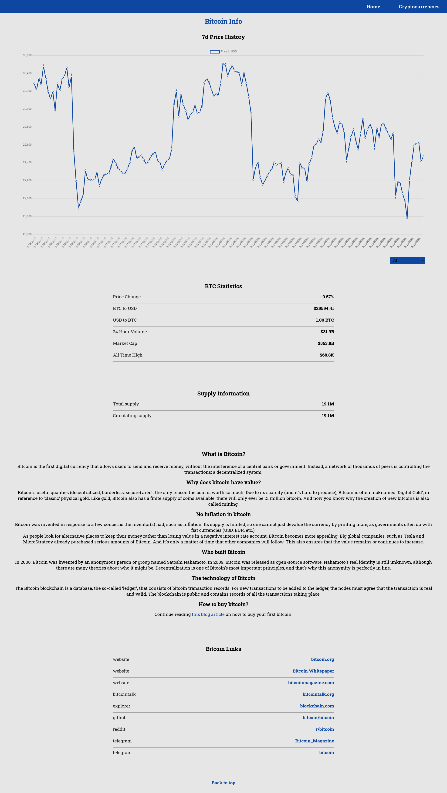

## Cyptoverse

Cryptoverse is a fully responsive, dynamic web application that uses API's to create a real-time database of Cryptocurrencies.

## Demo Link:

Access my site [here](https://neptunerjo.github.io/cryptoverse/)

## Table of Content:

- [Screenshots](#screenshots)
- [Technologies](#technologies)
- [Setup](#setup)
- [Approach](#approach)

## Screenshots

## Technologies

Built with `React`, `CSS3`, `Millify`, `ChartJS`, and `CoinRanking API`. Tested with `Cypress`.

## Setup

- Download or clone the repository
- Run `npm install`
- Run `npm start` to view a local version on `http://localhost:3000/`

### To run the Cypress Suite

- Run `npm install` if you havent already
- Run `npm run cypress:open` to open the terminal
- Choose a test file to run and double click to run it in the browser

## Approach

Utilized the CoinRanking API to supply the frontend with statistics, coins, and coin data.

To minimize the number of API calls made during the app's use, all of the general data (coins, statistics) is stored globally.
When a user clicks on a coin, the application fetches the data on said coin, which supplies all of the data on the info page.

To create a more interactive user experience, ChartJS was used to build a up-to-date line graph depicting the coin's price history.
Users can choose to view price history of the coin from the past 3 minutes to 5 years.
