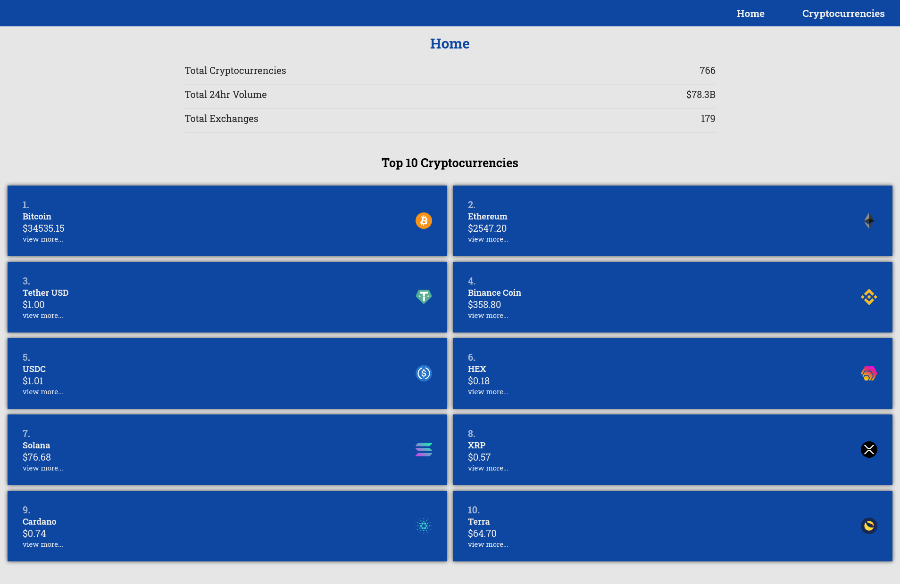
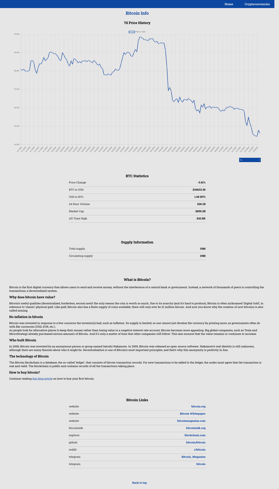

## Cyptoverse

Cryptoverse is a fully responsive, dynamic web application that uses API's to create a real-time database of Cryptocurrencies.

## Demo Link:

Access my site at [Demo Link](https://neptunerjo.github.io/cryptoverse/)

## Table of Content:

- [Screenshots](#screenshots)
- [Technologies](#technologies)
- [Setup](#setup)
- [Approach](#approach)

## Screenshots

## Technologies

Built with `React`, `React-Redux`, `CSS3`, `Millify`, and `APIs`. Tested with `Jest` and `React-Testing-Library`.

## Setup

- Download or clone the repository
- Run `npm install`
- Run `npm start` to view a local version on `http://localhost:3000/`

## Approach

In order to create a dynamic website that relies entirely on APIs for its data,
`Redux` was used to store the global state. `React-Router` made it easy to create unique pages for
each coin and news article.
